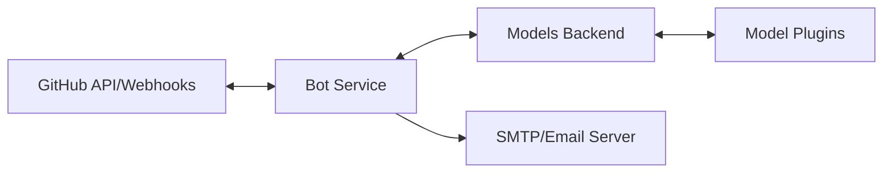

# TagDebt Bot Architecture

TagDebt follows a decoupled, microservices-inspired architecture consisting of two primary services that communicate over HTTP.

## System Overview

### 1. Bot Service (`/Bot`)
- **Role**: The orchestrator. It receives webhooks from GitHub, parses bot commands, and manages the labeling workflow.
- **Technology**: Flask (Python).
- **Independence**: The bot is model-agnostic. It sends text to the `ModelsBackend` and expects a label in return.

### 2. Models Backend (`/ModelsBackend`)
- **Role**: A flexible classification engine. It acts as an abstraction layer for Machine Learning models.
- **Technology**: FastAPI (Python).
- **Design**: Implements a plugin system where multiple classification models (Deep Learning, LLM, etc.) can be loaded and served simultaneously.

---

## Requirements and Ports

### Service Ports
To run the bot locally, the following ports must be available:
- **Port 5001**: Used by the Bot Service to receive webhooks.
- **Port 8000**: Used by the Models Backend Service.

### Requirements Breakdown

| Setup | Storage | CPU/GPU |
| :--- | :--- | :--- |
| **Bot Only** | < 1GB | Low |
| **LLM via API** | ~2GB | Low |
| **Local ML (Li 2022)**| ~14GB | Medium |
| **Local LLM** | 20GB+ | High (GPU recommended) |

---

## Deployment Strategies

### A. All-in-One (Default)
Both services are deployed together using the provided `docker-compose.yml`. This is ideal for most projects.

### B. Distributed / Shared Service
Since the services are decoupled, they can be deployed independently:
- **Shared Backend**: A single `ModelsBackend` instance can serve multiple `Bot` instances across different organizations.
- **Scaling**: The `ModelsBackend` can be deployed on a high-memory/GPU instance to support heavy models, while the `Bot` runs on a lightweight instance.

### Development Mode
Run `docker compose watch` to automatically synchronize code modifications into the running Docker containers.

---

## Detailed Configuration Reference

Configuration is managed via `config.json` files in the service directories.

**Note**: You should create these files by copying the provided `config.json.example` templates.

### Bot Configuration (`Bot/config.json`)

The bot can be configured globally via `Bot/config.json` or on a per-repository basis by placing a `Bot/config.json` file in the target repository.

| Key | Type | Description |
| :--- | :--- | :--- |
| `payload-type` | string | "title", "description", "merged" (both in one string), or "both" (separate labels). |
| `endpoint` | string | URL of the ML model endpoint in the backend. |
| `label-location` | string | JSON path in the model response for the generated label (e.g., "label"). |
| `auto-label` | boolean | If true, labels new issues automatically upon creation. |
| `initial-message` | boolean | If true, posts an intro comment when an issue is created. |
| `send-emails` | boolean | Enable/disable email notifications. |
| `when-to-send` | string | "label" (on labeling), "lingering" (inactive issues), or "all". |
| `email-info` | object | Detailed settings for the email sender (see below). |

#### `email-info` Settings
- `which-labels`: "all", "except", or "specific".
- `except-labels`: List of labels for which the bot does *not* send notifications.
- `specific-labels`: List of labels for which the bot *only* sends notifications.
- `lingering-issue-threshold`: Number of days (integer) after which an issue is considered lingering.
- `lingering-mode`: "creation-date" or "last-modified" to determine lingering status.
- `recipients`: List of email addresses to receive notifications.
- `email-body-template`: Template strings for `label`, `lingering` (list of two strings), and `feature` emails.
- `email-subject-template`: Subject strings for `label`, `lingering`, and `feature` emails.

#### Email Template Placeholders
The bot replaces these with actual data at runtime:
- **/issue_label**: The label assigned.
- **/issue_number**: The issue number.
- **/issue_author**: The GitHub username of the author.
- **/issue_title**: The issue title.
- **/issue_description**: The issue description text.
- **/issue_link**: Hyperlink to the issue.
- **/issue_repository**: The repository name.
- **/issue_updated_at**: Date and time of last update.
- **/issue_created_at**: Date and time of creation.

---

### Models Backend Configuration (`ModelsBackend/config.json`)
- `plugins`: List of module paths to load (e.g., `["plugins.satd_li_2022.model"]`).
- `models`: List of instance definitions:
    - `type`: Registered plugin type (e.g., `Model1_IssueTracker_Li2022_ESEM`).
    - `name`: Unique identifier for the instance (exposed at `/models/{name}`).
    - `parameters`: Key-value pairs passed to the model's constructor.

---

## Troubleshooting

### Labels not assigned
- Verify `config.json` exists in both local `/Bot` and the target repository's `/Bot` folder.
- Ensure Smee CLI is running and connected.
- Check if the generated label is already assigned to the issue.

### Emails not sent
- Verify `config.json` setup for `email-info`.
- Ensure `bot_email.secret` is correctly formatted in the local `/Bot` directory:
    - Line 1: Email address
    - Line 2: App password (not regular password)
- Check Smee CLI connectivity.
